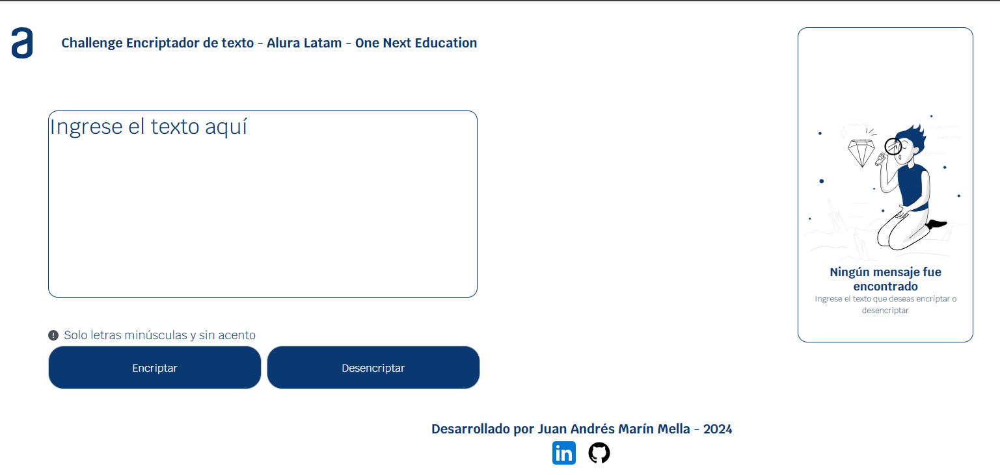
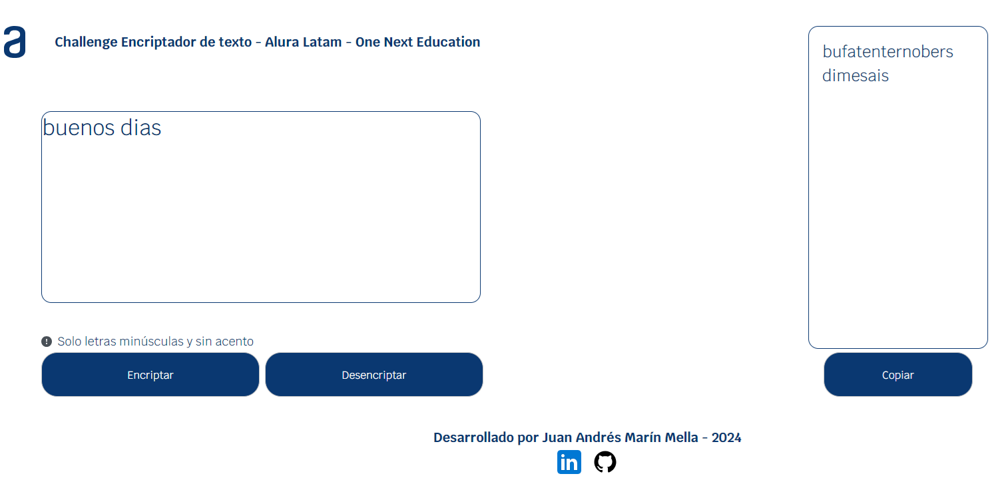
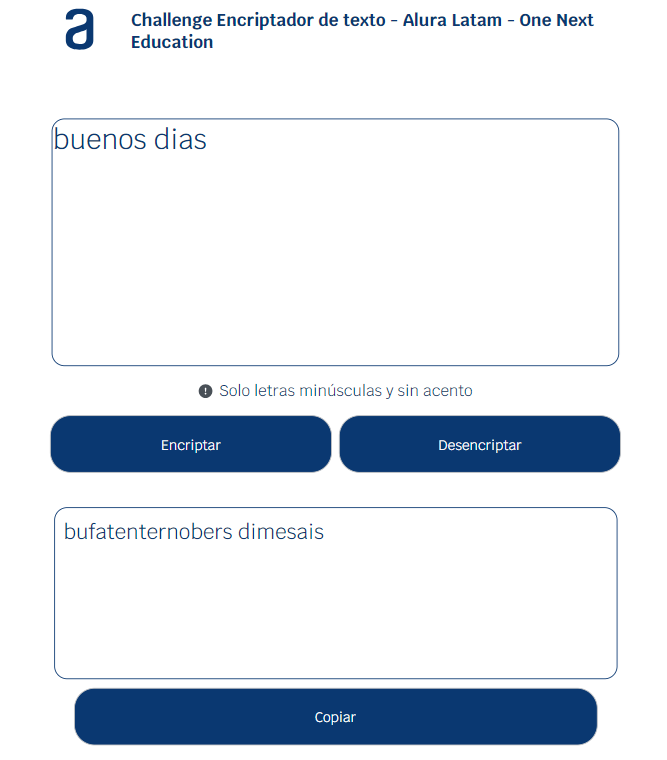
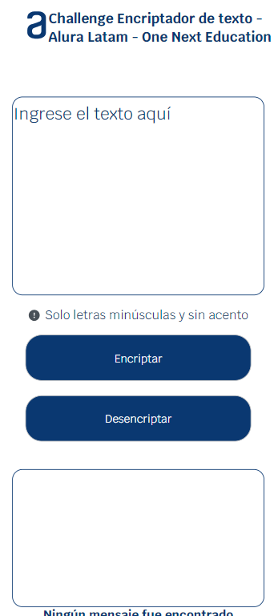

# Challenge Encriptador de Texto - Alura Latam - One Next Education


Este proyecto es una solución al desafío **"Challenge Encriptador de Texto"** proporcionado por Alura Latam. La aplicación permite encriptar y desencriptar mensajes de texto basándose en una simple sustitución de letras.

## Descripción del Proyecto

El **Encriptador de Texto** es una aplicación interactiva que transforma mensajes de texto de acuerdo con ciertas reglas de encriptación y desencriptación. Está pensado para proteger la privacidad de los mensajes mediante la sustitución de caracteres. Además, se incluye la funcionalidad de copiar el texto resultante al portapapeles.

### Características

- Encriptación de textos usando sustituciones predefinidas de caracteres.
- Desencriptación de mensajes encriptados.
- Validación de textos para asegurar que sólo se utilicen letras minúsculas y sin acentos.
- Copiado del texto encriptado/desencriptado al portapapeles.

## Capturas de Pantalla






## Requisitos

- Navegador moderno compatible con JavaScript (Chrome, Firefox, Edge, Safari).
- No se requieren dependencias externas.

## Instalación

1. Clona el repositorio en tu máquina local:
   ```bash
   git clone https://github.com/amarinmella/Challenger-Encriptador.git

